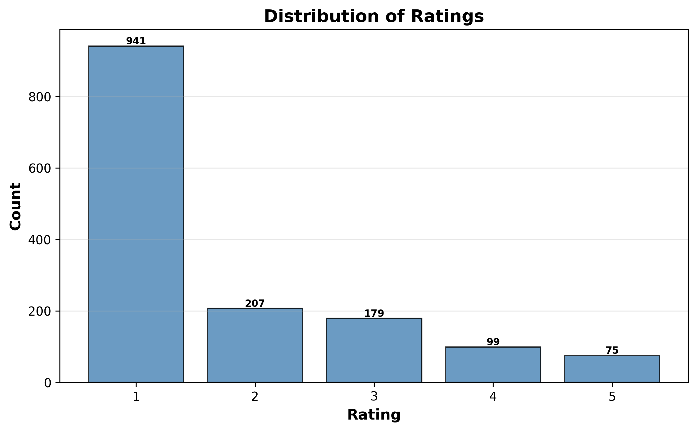
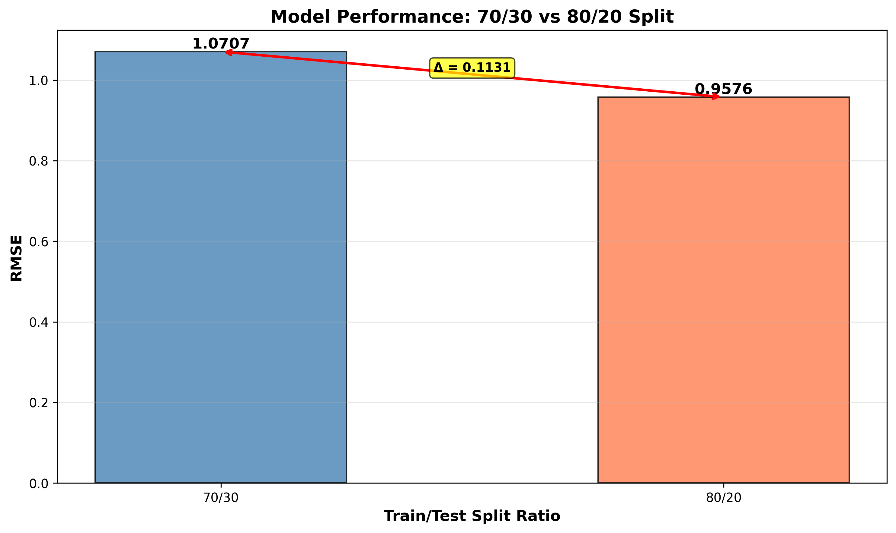
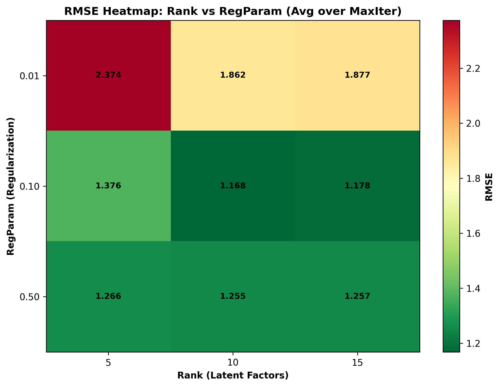
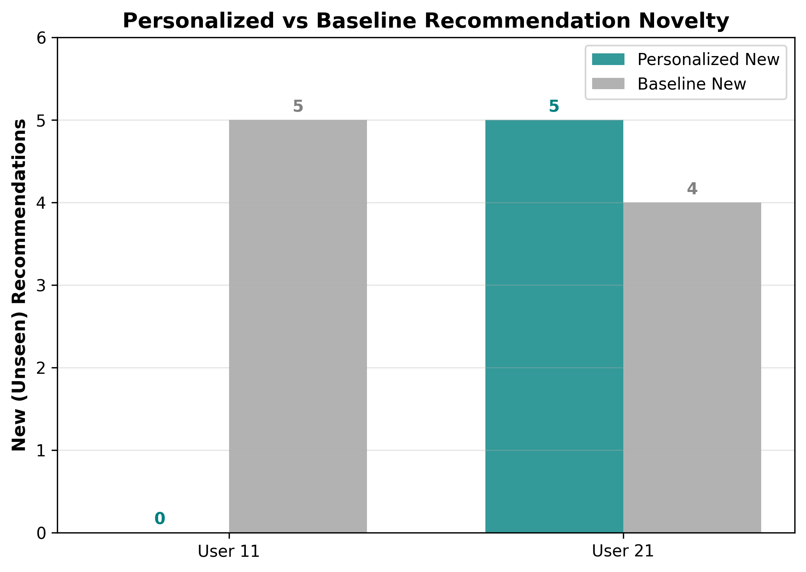

# Collaborative Filtering with Spark

Spark ALS recommendation workflow with dataset profiling, split-ratio testing, metric evaluation, hyperparameter tuning, and personalized recommendations.

## Preview

<table>
  <tr>
    <td width="50%">
      
    </td>
    <td width="50%">
      
    </td>
  </tr>
</table>

<table>
  <tr>
    <td width="50%">
      
    </td>
    <td width="50%">
      
    </td>
  </tr>
</table>

## Project summary

This project builds a Spark-based collaborative filtering pipeline for movie ratings. It starts with data profiling, then evaluates model behavior under different train/test splits, compares regression and classification-style metrics, tunes ALS hyperparameters, and produces personalized recommendations for selected users.

## Problem

This project asks how well Spark ALS can model user preferences from sparse rating data and how model quality changes under different evaluation choices.

## Data

- `movies.csv` - userId, movieId, rating records used for recommendation modeling

## Cloud / big data techniques

- PySpark DataFrame ingestion and aggregation
- Spark ALS collaborative filtering
- train/test splitting and RMSE evaluation
- cross-validation with `ParamGridBuilder` and `CrossValidator`
- threshold-based classification-style metric analysis
- visualization of rating distributions, user activity, and tuning outcomes

## Key outputs

- dataset sparsity and rating-distribution analysis
- top movies and top users summary
- RMSE comparison across 70/30 and 80/20 splits
- regression metrics: MSE, RMSE, MAE
- classification-style metrics: precision, recall, F1
- hyperparameter heatmap and tuning comparison charts
- personalized movie recommendations for selected users

## Repository structure

| File | Role |
| --- | --- |
| `Data_Description.py` | Explores the dataset and summarizes sparsity, ratings, and user behavior |
| `Performance_Assessment.py` | Compares ALS performance under different train/test splits |
| `Error_Metrics.py` | Evaluates regression and thresholded classification-style metrics |
| `Hyperparameter_Tuning.py` | Runs ALS hyperparameter tuning with cross-validation |
| `Personalized_Recommendations.py` | Produces recommendations and user-specific analysis |
| `movies.csv` | Input rating dataset |
| `*.png` | Visual summaries generated by the scripts |

## Notes

The scripts read `movies.csv` from the repository root so the project is easy to run after cloning or copying.
